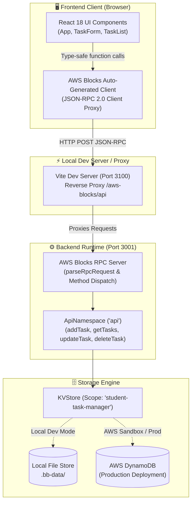
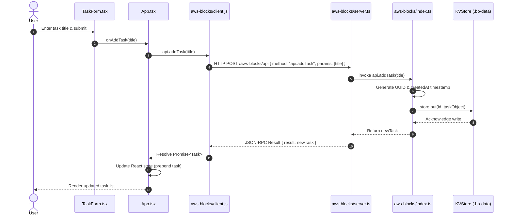
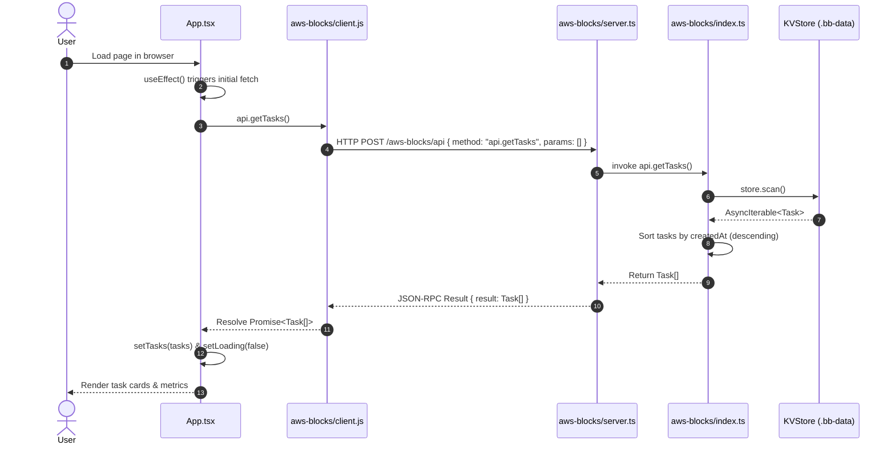
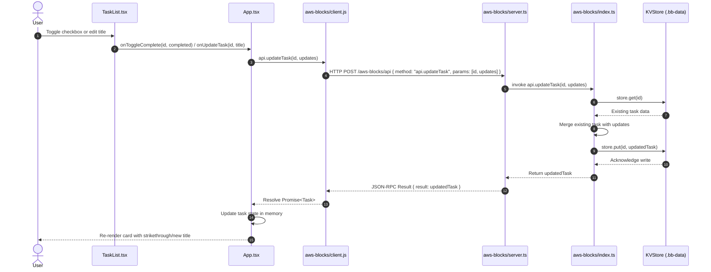
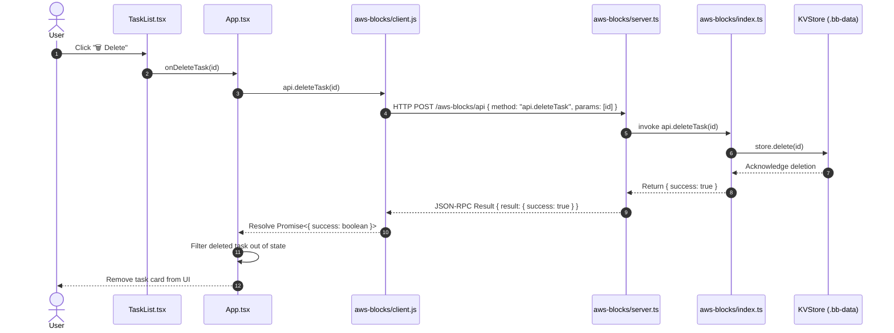

# 📚 Student Task Manager

> A modern, end-to-end type-safe full-stack task tracking application built with **AWS Blocks**, **React 18**, **TypeScript**, and **Vite**.

---

## 📑 Table of Contents

- [Overview](#-overview)
- [Key Features](#-key-features)
- [High-Level Architecture](#-high-level-architecture)
- [Full-Stack Architecture & Data Flow](#-full-stack-architecture--data-flow)
- [Core Services & Building Blocks](#-core-services--building-blocks)
- [CRUD Workflows & Sequence Diagrams](#-crud-workflows--sequence-diagrams)
  - [1. Create Workflow (`addTask`)](#1-create-workflow-addtask)
  - [2. Read Workflow (`getTasks`)](#2-read-workflow-gettasks)
  - [3. Update Workflow (`updateTask`)](#3-update-workflow-updatetask)
  - [4. Delete Workflow (`deleteTask`)](#4-delete-workflow-deletetask)
- [Project Directory Structure](#-project-directory-structure)
- [Getting Started & Setup Guide](#-getting-started--setup-guide)
  - [Prerequisites](#prerequisites)
  - [Step-by-Step Installation](#step-by-step-installation)
  - [Running the Application](#running-the-application)
- [API Reference & Interface Contracts](#-api-reference--interface-contracts)
- [Local Development vs. AWS Cloud Deployment](#-local-development-vs-aws-cloud-deployment)
- [Troubleshooting & FAQs](#-troubleshooting--faqs)

---

## 🌟 Overview

**Student Task Manager** is designed to demonstrate full-stack cloud development using **AWS Blocks**. AWS Blocks bridges frontend and backend development by providing end-to-end type safety, automated client generation, and local mock storage without requiring upfront AWS cloud provisioning.

When developed locally, tasks persist to an embedded local database mock (`.bb-data/`). When deployed to AWS, the exact same backend logic binds seamlessly to **AWS DynamoDB** and **AWS Lambda** via AWS CDK constructs with zero application code changes.

---

## ✨ Key Features

- ➕ **Task Creation:** Add new assignments, study goals, or chores.
- 📋 **Live Task Listing:** View all tasks sorted by creation timestamp.
- ✏️ **In-Place Task Editing:** Modify existing task titles with instantaneous UI updates.
- 🗹 **Task Completion Toggle:** Mark tasks as completed or undo completion.
- 🗑️ **Task Deletion:** Remove tasks permanently from storage.
- 🔒 **End-to-End Type Safety:** Shared TypeScript models between frontend and backend APIs.
- 💾 **Local & Cloud Data Persistence:** Local mock persistence during development and seamless migration to AWS DynamoDB in production.

---

## 🏛 High-Level Architecture

The following diagram illustrates how the client application interacts with the AWS Blocks runtime and data persistence layers:



---

## 🏗 Full-Stack Architecture & Data Flow

AWS Blocks eliminates the manual boilerplate of managing REST endpoints, URL serialization, and fetch wrappers.

```mermaid
graph LR
    subgraph FrontendLayer["1. Presentation Layer"]
        A["React Components\n(src/App.tsx)"]
    end

    subgraph TransportLayer["2. Transport & RPC Layer"]
        B["Generated Client Proxy\n(aws-blocks/client.js)"]
        C["JSON-RPC 2.0 Protocol\n(POST /aws-blocks/api)"]
    end

    subgraph LogicLayer["3. Business Logic Layer"]
        D["AWS Blocks Dev Server\n(aws-blocks/server.ts)"]
        E["API Namespace Handlers\n(aws-blocks/index.ts)"]
    end

    subgraph PersistenceLayer["4. Data Storage Layer"]
        F["KVStore Block\n(Local Mock / DynamoDB)"]
    end

    A -->|await api.addTask(...) | B
    B -->|'{ method: api.addTask, params: [...] }'| C
    C -->|Dispatch RPC| D
    D -->|Execute Handler| E
    E -->|store.put(...) / store.scan()| F
    F -->|Return Data| E
    E -->|RPC Response Result| D
    D -->|JSON Response| C
    C -->|Resolve Promise| B
    B -->|State Update| A
```

---

## 🧩 Core Services & Building Blocks

### 1. AWS Blocks Core (`@aws-blocks/core` & `@aws-blocks/blocks`)
- **`Scope`**: Establishes isolated resource boundaries and namespacing for backend infrastructure components.
- **`ApiNamespace`**: Exposes TypeScript functions as callable RPC endpoints. Automatically serializes parameters and deserializes responses with complete type inference.
- **`KVStore`**: High-performance Key-Value storage abstraction. Backed by local storage in development mode and Amazon DynamoDB in cloud deployments.

### 2. Frontend Framework & Tooling
- **React 18**: Component-driven user interface with reactive hooks (`useState`, `useEffect`).
- **TypeScript 5**: Strict static type checking and shared data interfaces across client and server boundaries.
- **Vite 5**: Fast development server with Hot Module Replacement (HMR) and custom proxying to the AWS Blocks backend.
- **Concurrently**: Runs both the backend Node runtime and frontend Vite server concurrently in a single command.

---

## 🔄 CRUD Workflows & Sequence Diagrams

### 1. Create Workflow (`addTask`)

Creates a new unique task, assigns an ID and timestamp, and writes it to the KV store.



---

### 2. Read Workflow (`getTasks`)

Fetches all stored tasks on initial mount or manual refresh.



---

### 3. Update Workflow (`updateTask`)

Updates task title or completion status (`completed: true/false`).



---

### 4. Delete Workflow (`deleteTask`)

Permanently deletes a task by its unique identifier.



---

## 📁 Project Directory Structure

```text
AWS-Blocks-student-task-tracker/
├── .bb-data/                      # Local database mock storage (persists task records)
├── .npmrc                         # PNPM hoisting configurations for AWS Blocks
├── aws-blocks/
│   ├── client.js                  # Auto-generated client proxy for browser integration
│   ├── index.ts                   # Backend logic: Scope, KVStore & ApiNamespace CRUD definitions
│   └── server.ts                  # Local server bootstrap script running on port 3001
├── src/
│   ├── components/
│   │   ├── TaskForm.tsx           # Form component for creating and editing tasks
│   │   └── TaskList.tsx           # List component rendering interactive task cards
│   ├── App.tsx                    # Main application component & state coordinator
│   ├── main.tsx                   # React DOM mount point
│   └── types.ts                   # Unified TypeScript data contracts
├── index.html                     # HTML5 single-page template
├── package.json                   # Project dependencies and startup scripts
├── tsconfig.json                  # TypeScript compiler configuration & path aliases
└── vite.config.ts                 # Vite bundler configuration & backend API reverse proxy
```

---

## 🚀 Getting Started & Setup Guide

### Prerequisites
- **Node.js:** v22.0.0 or higher
- **pnpm:** v9.0.0+ (recommended) or **npm:** v10.0.0+

---

### Step-by-Step Installation

1. **Clone the repository:**
   ```bash
   git clone https://github.com/SUJITH467/AWS-Blocks-student-task-tracker.git
   cd AWS-Blocks-student-task-tracker
   ```

2. **Install dependencies:**
   Because AWS Blocks utilizes peer package hoisting, install dependencies via `pnpm`:
   ```bash
   npx pnpm install
   ```
   *(or `pnpm install` if pnpm is installed globally)*

---

### Running the Application

Start both the backend server and the frontend client simultaneously:

```bash
npm run dev
```

#### Individual Commands (Optional)
If you prefer running the backend and frontend in separate terminals:

- **Terminal 1 (Backend Server):**
  ```bash
  npm run dev:server
  ```
- **Terminal 2 (Frontend Client):**
  ```bash
  npm run dev:client
  ```

Once started:
- 🌐 **Frontend UI:** Open [http://localhost:3100](http://localhost:3100)
- ⚙️ **Backend RPC:** Listening on [http://localhost:3001](http://localhost:3001)

---

## 📖 API Reference & Interface Contracts

### Shared Data Model (`src/types.ts`)

```typescript
export interface Task {
  id: string;        // Unique UUID v4 identifier
  title: string;     // Task title / description
  completed: boolean;// Completion status flag
  createdAt: number; // Unix timestamp in milliseconds
}
```

### Backend API Methods (`aws-blocks/index.ts`)

| Method | Parameters | Return Type | Description |
| :--- | :--- | :--- | :--- |
| `getTasks()` | None | `Promise<Task[]>` | Retrieves all tasks sorted from newest to oldest. |
| `addTask(title)` | `title: string` | `Promise<Task>` | Creates and stores a new task item with a generated UUID. |
| `updateTask(id, updates)` | `id: string, updates: Partial<Task>` | `Promise<Task>` | Updates specific fields (`title` or `completed`) of a task. |
| `deleteTask(id)` | `id: string` | `Promise<{ success: boolean }>` | Deletes the specified task from the KVStore. |

---

## ☁️ Local Development vs. AWS Cloud Deployment

| Feature | Local Development (`npm run dev`) | AWS Cloud Deployment |
| :--- | :--- | :--- |
| **Backend Execution** | Node.js TSX process on `localhost:3001` | AWS Lambda (Serverless function) |
| **Database** | Embedded local store in `.bb-data/` | Amazon DynamoDB Table |
| **Frontend Delivery** | Vite Dev Server on `localhost:3100` | Amazon CloudFront CDN + Amazon S3 |
| **API Transport** | Local HTTP Reverse Proxy (`/aws-blocks/api`) | Amazon API Gateway Stage Endpoint |
| **AWS Credentials** | None required | IAM Role / AWS Credentials |

---

## 🛠 Troubleshooting & FAQs

### 1. `Unknown project config "shamefully-hoist"`
- **Cause:** Standard `npm` warns or errors when encountering pnpm-specific flags in `.npmrc`.
- **Solution:** Use `npx pnpm install` to install dependencies.

### 2. `Cannot find module 'aws-blocks'`
- **Cause:** The client proxy file (`aws-blocks/client.js`) has not been generated yet.
- **Solution:** Run the backend server (`npm run dev:server` or `npm run dev`) at least once. The server automatically generates `aws-blocks/client.js` upon startup.

### 3. Port `3001` or `3100` already in use (`EADDRINUSE`)
- **Cause:** A previous instance of the server was not shut down cleanly.
- **Solution:** Stop background Node tasks or terminate the process holding the port using:
  ```powershell
  # Windows PowerShell:
  Get-Process node | Stop-Process
  ```

---

## 📄 License

This project is open source and available under the [Apache-2.0 License](LICENSE).
"# aws-blocks-event" 
